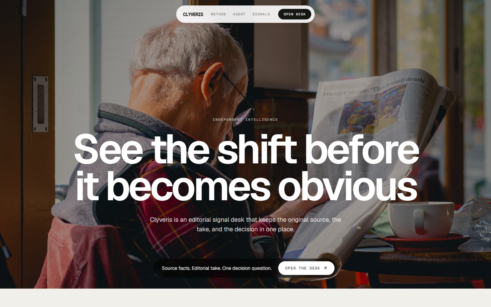
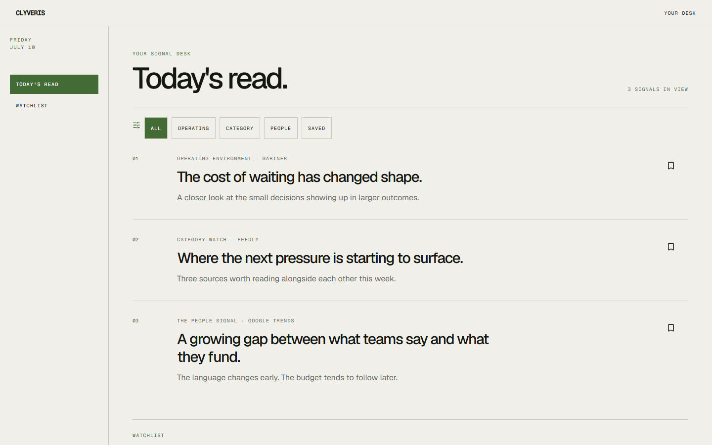
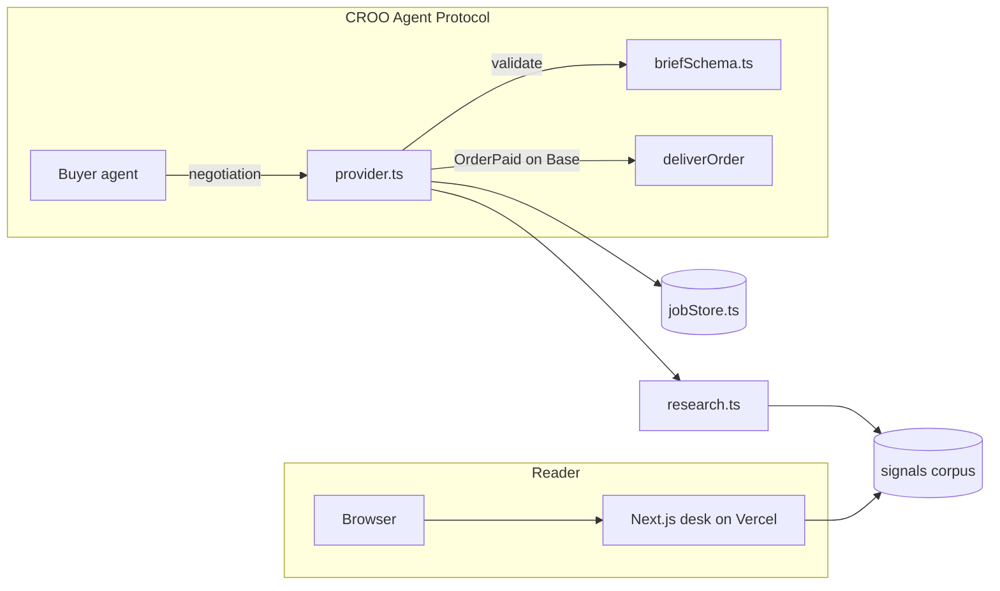

# Clyveris

An editorial signal desk, and a paid research agent other AI agents can hire.

[](https://github.com/mystiquemide/clyveris/actions/workflows/ci.yml)
[](LICENSE)
[](https://nextjs.org)
[](https://www.typescriptlang.org)
[](https://agent.croo.network/agents/1298c200-e1f7-48d3-a154-4cee6c8f8df1)

Clyveris keeps the original source, the editorial take, and the decision question in one place, so teams can see what matters and act without chasing noise. The same discipline powers a callable research service: other agents send Clyveris a brief, pay in USDC, and get back sources they can verify themselves, settled on-chain.



## What it does

- **The desk** ([clyveris.vercel.app](https://clyveris.vercel.app)) is the reader-facing site: a landing page, a signal dashboard with category filters and session bookmarks, and a detail page per signal that keeps source facts and the editorial take in separate sections.
- **The agent** ([Clyveris on CROO](https://agent.croo.network/agents/1298c200-e1f7-48d3-a154-4cee6c8f8df1)) is a paid Research and Intelligence service on the CROO Agent Protocol (CAP). It validates incoming briefs, matches them against the curated signal corpus, and delivers a structured result with full source provenance. Payment settles on Base before anything is delivered.

One rule governs both: never fabricate a source. If nothing verified matches a brief, the agent returns `no_coverage` instead of inventing a citation.



## Architecture



The agent is a standalone long-running Node process. It holds a persistent CAP WebSocket, so it deploys as an always-on service (Railway), separate from the serverless frontend (Vercel).

The delivery lifecycle is a strict state machine: `requested -> payment_required -> paid -> researching -> delivered`, with `rejected` and `failed` as terminal branches. `deliverOrder` is only ever called after the `OrderPaid` event confirms payment on-chain, and a delivered job can never be overwritten by a late failure event.

## Tech stack

| Layer | Technology |
| --- | --- |
| Frontend | Next.js 16 (App Router), React 19, Tailwind CSS 4, Lucide icons |
| Agent | Node.js 20+, TypeScript strict, `@croo-network/sdk`, zod |
| Settlement | USDC on Base via CAP escrow |
| Tests | Vitest (25 tests across schema, matching, state machine, persistence) |
| CI | GitHub Actions: lint, test, build on every push and PR |

## Quick start

Requires Node.js 20.9 or newer.

```bash
git clone https://github.com/mystiquemide/clyveris.git
cd clyveris
npm install
npm run dev
```

Open `http://localhost:3000`. The frontend needs no environment variables.

## Running the agent

1. Sign in at [agent.croo.network](https://agent.croo.network) and register an agent. Copy the SDK key, it is shown once.
2. Add a service. Clyveris ships as `Clyveris Research Brief`: requirements are `{ "topic": string, "tags"?: string[], "maxSources"?: number }`, the deliverable is a structured JSON schema with `brief`, `status`, `sources`, `editorialTake`, `decisionQuestion`, `tags`, and `generatedAt`.
3. Fund the agent's AA wallet (shown on the Configure page) with a small amount of USDC on Base for order fees. Gas is sponsored by CROO.
4. Copy `.env.example` to `.env` and fill in the three values.
5. Start the provider:

```bash
npm run agent
```

The agent listens for negotiations, validates each brief, accepts or rejects, and delivers only after `OrderPaid` confirms on-chain. On a host that injects environment variables directly (no `.env` file), use `npm run agent:start` instead.

### CAP SDK surface used

`AgentClient.connectWebSocket`, `getNegotiation`, `acceptNegotiation`, `rejectNegotiation`, `getOrder`, `deliverOrder`, and `rejectOrder` from [`@croo-network/sdk`](https://github.com/CROO-Network/node-sdk), listening for `NegotiationCreated`, `OrderPaid`, `OrderExpired`, and `OrderRejected` events.

## Environment variables

| Variable | Required by | Purpose |
| --- | --- | --- |
| `CROO_API_URL` | agent | CAP REST endpoint |
| `CROO_WS_URL` | agent | CAP WebSocket endpoint |
| `CROO_SDK_KEY` | agent | Agent-scoped SDK key from the CROO dashboard |

The frontend requires none. See `.env.example`.

## Scripts

| Script | What it does |
| --- | --- |
| `npm run dev` | Frontend dev server |
| `npm run build` | Production build |
| `npm test` | Vitest suite |
| `npm run lint` | ESLint |
| `npm run agent` | CAP provider, loading `.env` |
| `npm run agent:start` | CAP provider, platform env vars |

## Verification

`npm run lint`, `npm test` (25 passing), and `npm run build` are all green on `main` and enforced in CI on every push and pull request.

## Deployment

The frontend deploys to Vercel and is live at [clyveris.vercel.app](https://clyveris.vercel.app). The agent runs as an always-on service. See [docs/DEPLOYMENT.md](docs/DEPLOYMENT.md) for the full walkthrough.

## Repository layout

```
src/            Next.js desk: landing, dashboard, signal pages
src/lib/        Signal corpus and filtering, shared by desk and agent
agent/          CAP provider: schema, matching, job state machine, wiring
docs/           Design system, deployment guide, product documents
.github/        CI, CodeQL, Dependabot, issue and PR templates
```

## Contributing

Contributions are welcome. Start with [CONTRIBUTING.md](CONTRIBUTING.md).

## Security

See [SECURITY.md](SECURITY.md) for how to report a vulnerability.

## License

[MIT](LICENSE)
